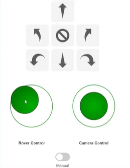
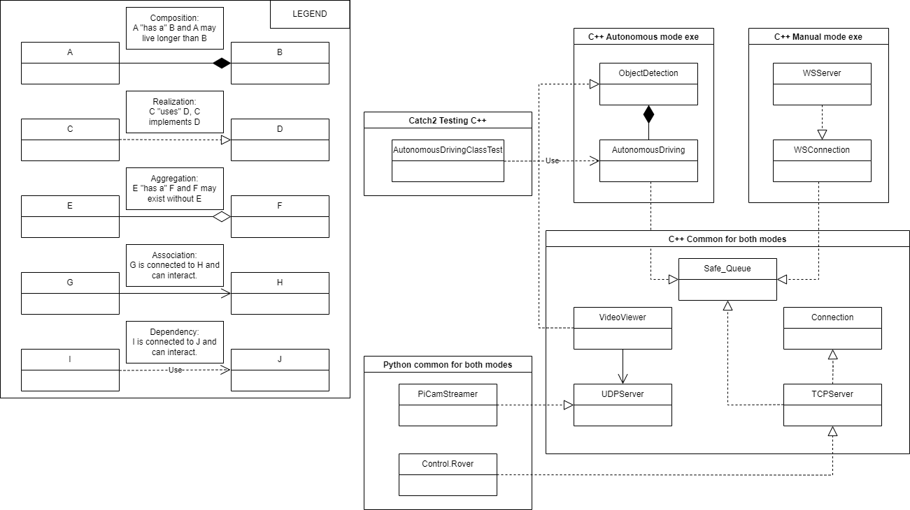

# RealtimeSysRover

NTNU project in the subject of "Real-Time Data Engineering for Cyber-Physical Systems".
Subject code: AIS2203 \
Subject title: Real-Time Data Engineering for Cyber-Physical Systems \
Type of grading: Folder delivery \
Group number: 11 

## Table of contents

- [Project description](#project-description)
- [Project structure](#project-structure)
  - [Conventions](#conventions)
  - [Code conventions](#code-conventions)
  - [Code comments](#code-comments)
  - [Git conventions](#git-conventions)
- [Useful scripts](#useful-scripts)
  - [SSH to the Raspberry Pi](#ssh-to-the-raspberry-pi)

## Project Examples
We have made som videos showcasing the project. \
[Response time](https://studntnu-my.sharepoint.com/:v:/g/personal/eliaswr_ntnu_no/EWi87b_iyIZOrnc9ruWKOOwBVUZs_E4Y96bD6tWY3gBKdA?nav=eyJyZWZlcnJhbEluZm8iOnsicmVmZXJyYWxBcHAiOiJPbmVEcml2ZUZvckJ1c2luZXNzIiwicmVmZXJyYWxBcHBQbGF0Zm9ybSI6IldlYiIsInJlZmVycmFsTW9kZSI6InZpZXciLCJyZWZlcnJhbFZpZXciOiJNeUZpbGVzTGlua0NvcHkifX0&e=PATrOl) \
[Manual driving](https://studntnu-my.sharepoint.com/:v:/g/personal/eliaswr_ntnu_no/Eb-q8U6NuvJPrBZSrzLcNmcBFaxeD-pxMTY2YjhxNBq3UA?nav=eyJyZWZlcnJhbEluZm8iOnsicmVmZXJyYWxBcHAiOiJPbmVEcml2ZUZvckJ1c2luZXNzIiwicmVmZXJyYWxBcHBQbGF0Zm9ybSI6IldlYiIsInJlZmVycmFsTW9kZSI6InZpZXciLCJyZWZlcnJhbFZpZXciOiJNeUZpbGVzTGlua0NvcHkifX0&e=dyemB7) \
[Autonomous driving 1](https://studntnu-my.sharepoint.com/:v:/g/personal/eliaswr_ntnu_no/EZTqBmYpsdZKnpgTVYWuvLMBaKTEVB1FwYP3FEAcLXWxTA?nav=eyJyZWZlcnJhbEluZm8iOnsicmVmZXJyYWxBcHAiOiJPbmVEcml2ZUZvckJ1c2luZXNzIiwicmVmZXJyYWxBcHBQbGF0Zm9ybSI6IldlYiIsInJlZmVycmFsTW9kZSI6InZpZXciLCJyZWZlcnJhbFZpZXciOiJNeUZpbGVzTGlua0NvcHkifX0&e=LZ4rJW) \
[Autonomous driving 2](https://studntnu-my.sharepoint.com/:v:/g/personal/eliaswr_ntnu_no/EQAXbACmU9JHkahWcl4XfPUBKJYO0LnO-uvwaiEMVzMghw?nav=eyJyZWZlcnJhbEluZm8iOnsicmVmZXJyYWxBcHAiOiJPbmVEcml2ZUZvckJ1c2luZXNzIiwicmVmZXJyYWxBcHBQbGF0Zm9ybSI6IldlYiIsInJlZmVycmFsTW9kZSI6InZpZXciLCJyZWZlcnJhbFZpZXciOiJNeUZpbGVzTGlua0NvcHkifX0&e=NOCe5m)

The manual rover control involves a user friendly GUI. \



## Project structure

### Folder structure
The folder structure has partly been inspired by the Threepp library: \
[Threepp Github Link](https://github.com/markaren/threepp/blob/master/.github/workflows/config.yml)

* **/application** - Application code
* **/doc** - Documentation
* **/src** - Source code
* **/include** - Header files
* **/tests** - Test code
* **/examples** - Example code
* **/RTS_RoverCode** - Submodule that goes into the Raspberry Pi
  * **/communication** - TCP and UDP client code
  * **/examples** - Example code
  * **/protobuf** - Protobuf files
  * **/rover_control** - Rover code
  * **/scripts** - Scripts for setting up, starting and shutting down RPI
* **/gui** - GUI code
* **/protobuf** - Protobuf files
* **/resources** - Resources such yolo-data

### Class structure


### Data flow


### Conventions

#### Code conventions:
If the code is inspired by a source, the source is referenced on the top of each file.
However, during the entire development of this project, Github Copilot has been used while writing code.

|                           |                     |
|---------------------------|---------------------|
| Variable names            | snake_case          |
| Class private member name | _snake_case         |
| Function names            | camelCase           |  
| Class name                | PascalCase          |
| Constants                 | ALL_CAPS_SNAKE_CASE |
| File naming               | snake_case.xxx      |

* Use namespaces to group related classes.
* Using IFNDEF as header guards.
* Use const whenever possible.

#### Code comments:
* Variable names should be self-explanatory.
* Documentation following Doxygen standard:
``` c++
/*
* @ brief Sum numbers in a vector.
* 
* This sum is the arithmetic sum, not some other kind of sum that only
* mathematicians have heard of.
* 
* @param values Container whose values are summed.
* @return sum of `values`, or 0.0 if `values` is empty.
*/
```

#### Git conventions:
* All commits should include a descriptive message.
* Merge to main branch must be done through pull requests.
* Pull requests must be reviewed and approved by at least one other team member.
## Useful scripts

### SSH to the Raspberry Pi
``` bash
ssh MartinElias@10.25.46.36
```

### Main inspiration
* [Threepp by Lars Ivar Hatledal](https://github.com/markaren/threepp) \
* [AIS2202 examples on NTNU blackboard by Lars Ivar Hatledal](https://ntnu.blackboard.com/ultra/courses/_44683_1/cl/outline) \
* [Yolov3-tiny cfg](https://github.com/pjreddie/darknet/blob/master/cfg/yolov3-tiny.cfg) \
* [Yolov3-tiny weights](https://pjreddie.com/media/files/yolov3-tiny.weights)