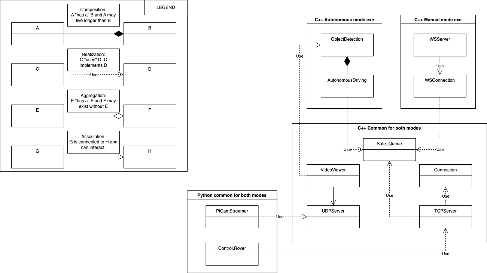

# RealtimeSysRover

NTNU project in the subject of "Real-Time Data Engineering for Cyber-Physical Systems".
Subject code: AIS2203 \
Subject title: Real-Time Data Engineering for Cyber-Physical Systems \
Type of grading: Folder delivery \
Group number: 11 \

## Table of contents

- [Project description](#project-description)
- [Project structure](#project-structure)
  - [Conventions](#conventions)
  - [Code conventions](#code-conventions)
  - [Code comments](#code-comments)
  - [Git conventions](#git-conventions)
- [Useful scripts](#useful-scripts)
  - [SSH to the Raspberry Pi](#ssh-to-the-raspberry-pi)

## Project description

## Project structure

### Folder structure
* **/application** - Application code
* **/src** - Source code
* **/include** - Header files
* **/tests** - Test code
* **/examples** - Example code
* **/RTS_RoverCode** - Submodule that goes into the Raspberry Pi
* **/gui** - GUI code
* **/protobuf** - Protobuf files
* **/resources** - Resources such yolo-data

### Class structure


### Conventions

#### Code conventions:

|                           |                     |
|---------------------------|---------------------|
| Variable names            | snake_case          |
| Class private member name | _snake_case         |
| Function names            | camelCase           |  
| Class name                | PascalCase          |
| Constants                 | ALL_CAPS_SNAKE_CASE |
| File naming               | snake_case.xxx      |

* Use namespaces to group related classes.
* Using IFNDEF as header guards.
* Use const whenever possible.

#### Code comments:
* Variable names should be self-explanatory.
* Documentation following Doxygen standard:
``` c++
/**
  * Sum numbers in a vector.
  *
  * This sum is the arithmetic sum, not some other kind of sum that only
  * mathematicians have heard of.
  *
  * @param values Container whose values are summed.
  * @return sum of `values`, or 0.0 if `values` is empty.
  */
```

#### Git conventions:
* All commits should include a descriptive message.
* Merge to main branch must be done through pull requests.
    


## Useful scripts

### SSH to the Raspberry Pi
``` bash
ssh MartinElias@10.25.46.36
```


